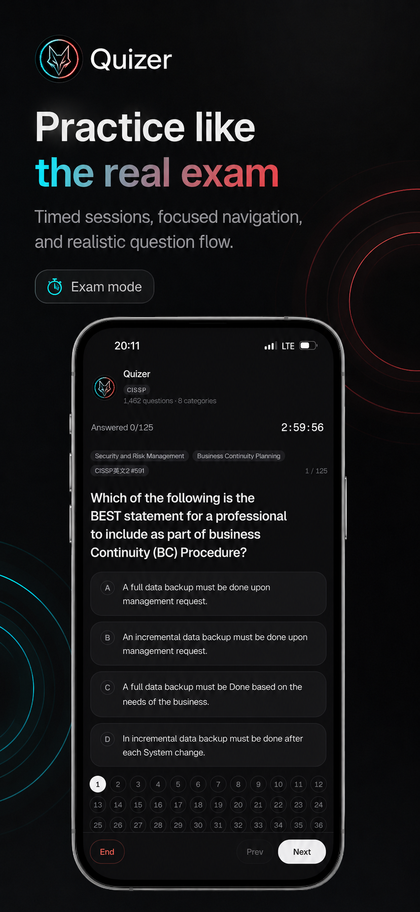
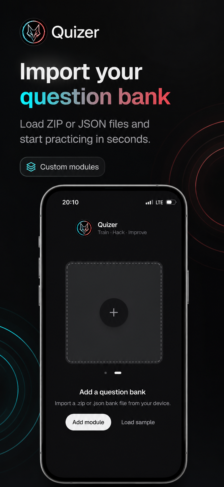
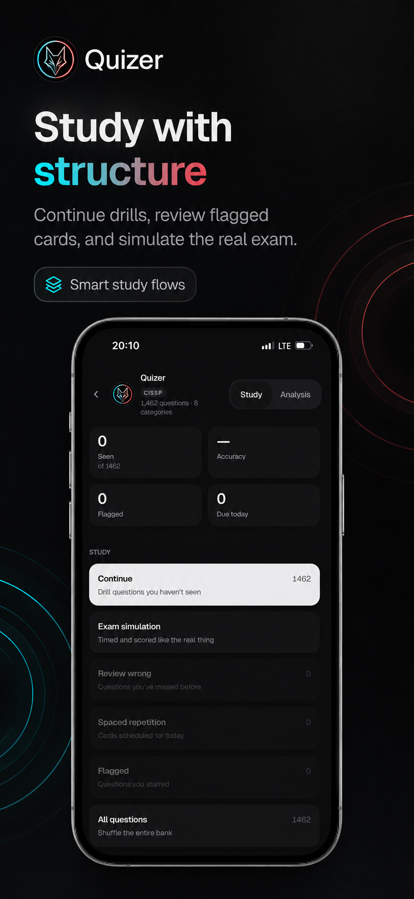
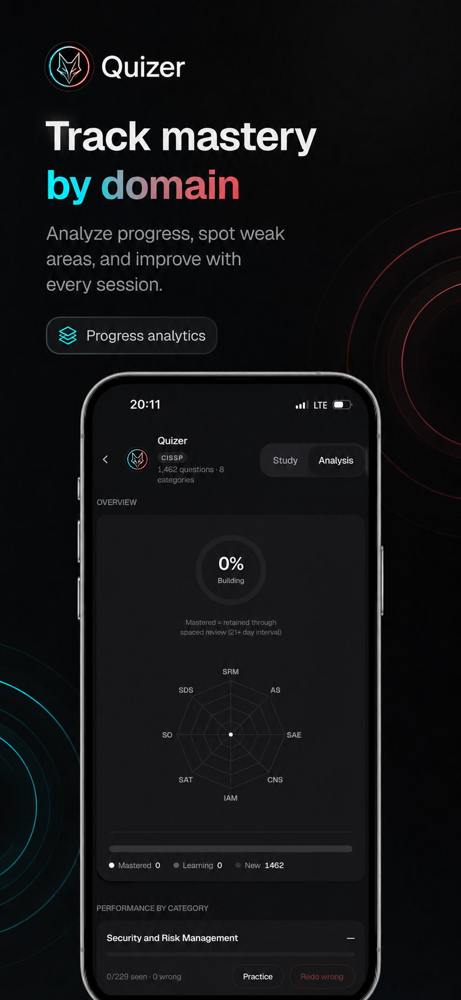

<div align="center">

# Quizer

**Local-first exam trainer. Import any question bank, study offline, track mastery.**

No backend. No account. Everything stays in your browser.

[Try the live demo](https://quizer-pwa.vercel.app) | [Get started](#get-started) | [Create a question bank](#authoring-a-bank)

<br />



<br />


&nbsp;&nbsp;

&nbsp;&nbsp;


</div>

<br />

**Study modes** &mdash; Drill with instant feedback. Simulate timed exams. Review
mistakes. Schedule with SM-2 spaced repetition. Revisit flagged questions.

**Analytics** &mdash; Per-category radar, per-topic mastery, weak-area detection,
readiness tracking. Know exactly where you stand.

**Offline-first** &mdash; Full PWA with service worker. Install to home screen,
study on a plane.

**Private by default** &mdash; Zero telemetry, zero network calls after first load.
Your progress never leaves your device.

---

<div align="center">
<h3>Skip the setup. Try it now.</h3>
<p>
<a href="https://quizer-pwa.vercel.app"><strong>Open Quizer in your browser &rarr;</strong></a>
</p>
<p>
Load the demo bank and start drilling in seconds. Works on desktop and mobile.<br />
No install, no sign-up, no data leaves your device.
</p>
</div>

> **Install as an app on your phone**
>
> Quizer is a PWA — it works offline and feels native once installed.
>
> - **iOS** — Open the link in Safari, tap the **Share** button, then **Add to Home Screen**.
> - **Android** — Open in Chrome, tap the **three-dot menu**, then **Add to Home Screen** (or accept the install banner).
>
> Once installed, it launches fullscreen with its own icon — no browser bar, no tabs.

---

## Run it yourself (local / self-host)

You don't need this to *use* Quizer — the [hosted demo](https://quizer-pwa.vercel.app)
above is the full app. This section is for running it locally or self-hosting your
own copy (development, private deployment, or contributing).

Requires Node `^20.19.0 || >=22.12.0`.

```sh
git clone https://github.com/sayre4ux/quizer.git
cd quizer/app
npm ci
npm run dev      # local dev server — open the printed URL
```

Then **Add a question bank** and select a `.quizbank.json` or `.quizbank.zip`
file, or load the bundled demo bank to look around.

### Self-hosting

Quizer is a fully static PWA — no server, no env vars, no database. Build it and
serve the `app/dist/` folder from any static host (Vercel, Netlify, Cloudflare
Pages, GitHub Pages, nginx, …):

```sh
cd app
npm run build    # outputs static assets to app/dist/
npm run preview  # preview the production build locally
```

### All commands

| Command | What it does |
|---------|-------------|
| `npm run dev` | Start the local dev server |
| `npm run build` | Type-check + production build (outputs `app/dist/`, generates PWA service worker) |
| `npm run preview` | Serve the production build locally |
| `npm test` | Run the test suite (vitest) |
| `npm run lint` | ESLint |

## Bring your own questions

Have your own question set (CSV, Anki export, docs, slides, markdown, even
screenshots)? Turn it into an importable bank.

### With an AI agent (recommended)

`quizbank-author` ships as a Claude Code plugin. Install it once, then just ask
your agent to convert your file — it handles the interpretation, validation, and
packaging for you:

```text
/plugin marketplace add sayre4ux/quizer
/plugin install quizbank-author@quizer
```

Then: *"Convert my questions.csv into a Quizer bank."* The agent extracts answers
from your source (it never invents them), validates the structure, and produces a
`.quizbank.json`/`.quizbank.zip` you can import.

### Manually (CLI)

Prefer to do it yourself? The same tooling runs standalone:

```sh
cd quizbank-author
npm ci

# validate
node scripts/validate-quizbank.mjs quizbank.json --assets assets --report conversion-report.json

# package
node scripts/pack-quizbank.mjs quizbank.json --assets assets --report conversion-report.json --out mybank.quizbank.zip
```

See [`quizbank-author/README.md`](quizbank-author/README.md) for the full
workflow and [`references/SCHEMA.md`](quizbank-author/references/SCHEMA.md) for
the format spec.

## Architecture

```
quizer/
  app/               Vite + React 19 + TypeScript + Tailwind v4
  quizbank-author/   Standalone bank conversion + validation tool
```

The authoritative `quizbank` v1 spec lives in app source:
[`format.ts`](app/src/lib/quizbank/format.ts) (types + limits) and
[`validate.ts`](app/src/lib/quizbank/validate.ts) (rules). The authoring tool's
validator is a faithful port, kept in lockstep by a
[parity test](app/src/lib/quizbank/parity.test.ts).

Contributing with an AI coding agent? See [AGENTS.md](AGENTS.md) for build/test
commands, conventions, and the security boundary to respect.

## Star History

<a href="https://star-history.com/#sayre4ux/quizer&Date">
 <picture>
   <source media="(prefers-color-scheme: dark)" srcset="https://api.star-history.com/svg?repos=sayre4ux/quizer&type=Date&theme=dark" />
   <source media="(prefers-color-scheme: light)" srcset="https://api.star-history.com/svg?repos=sayre4ux/quizer&type=Date" />
   
 </picture>
</a>

## License

[MIT](LICENSE)
